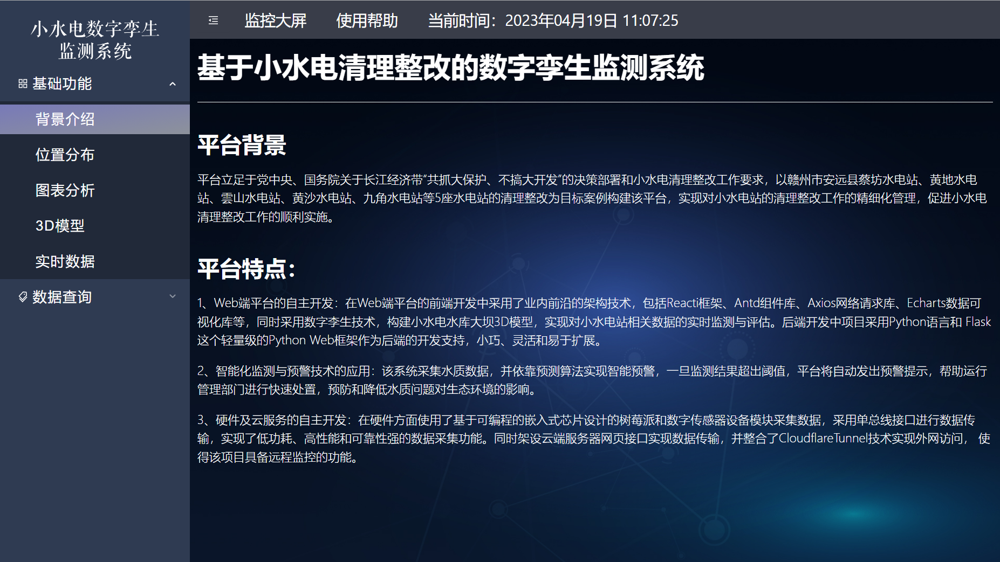
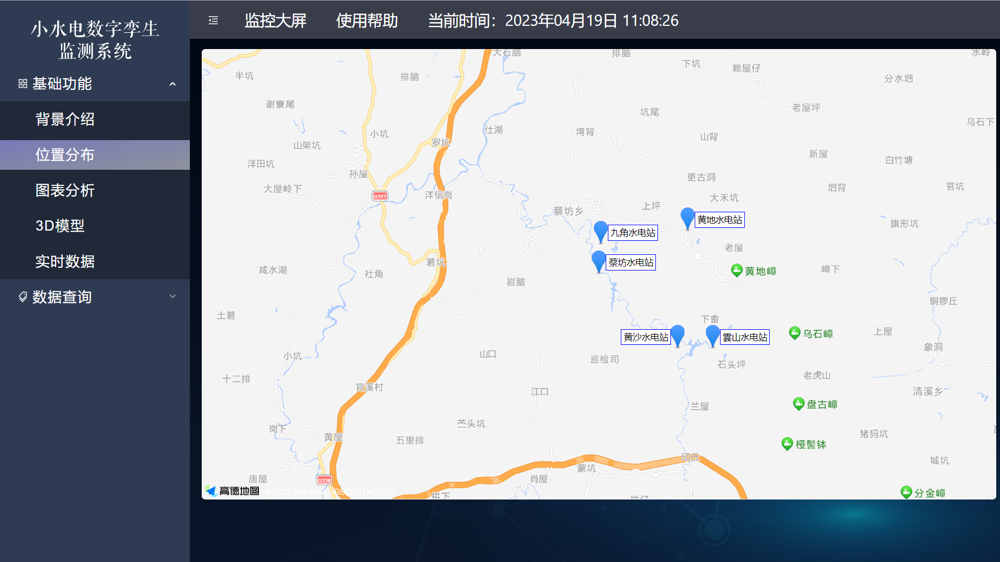
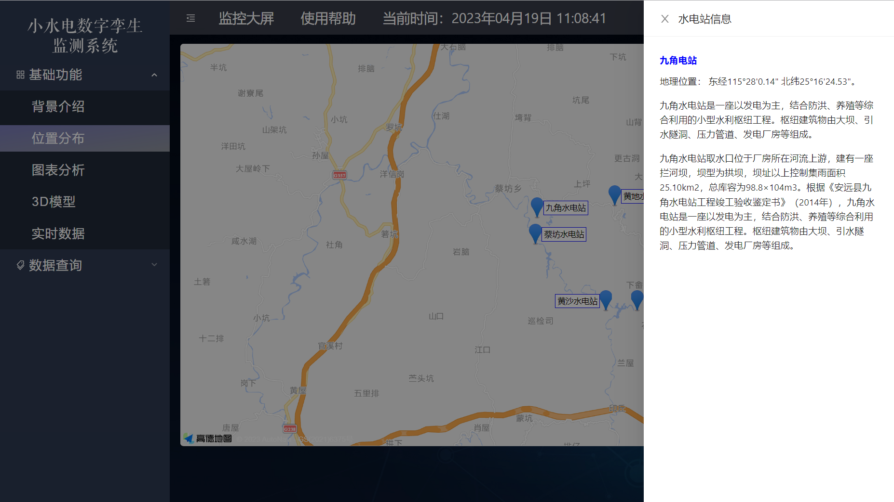
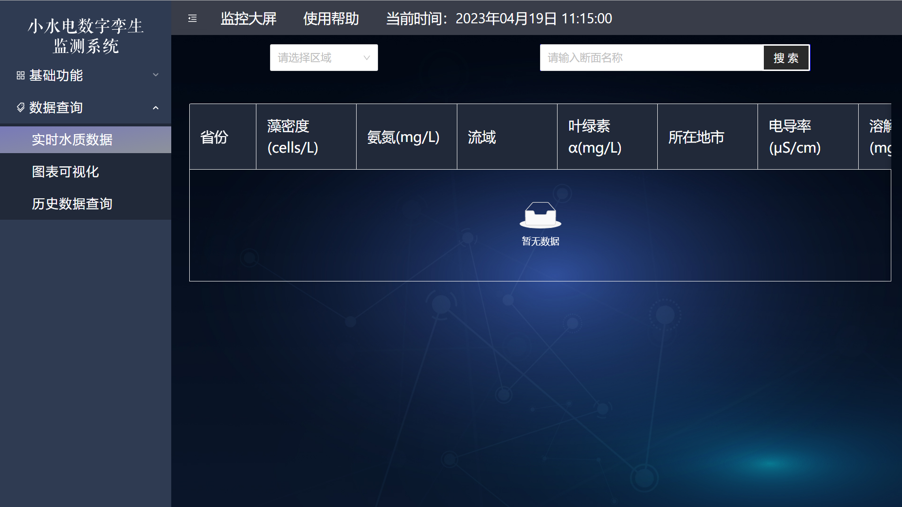
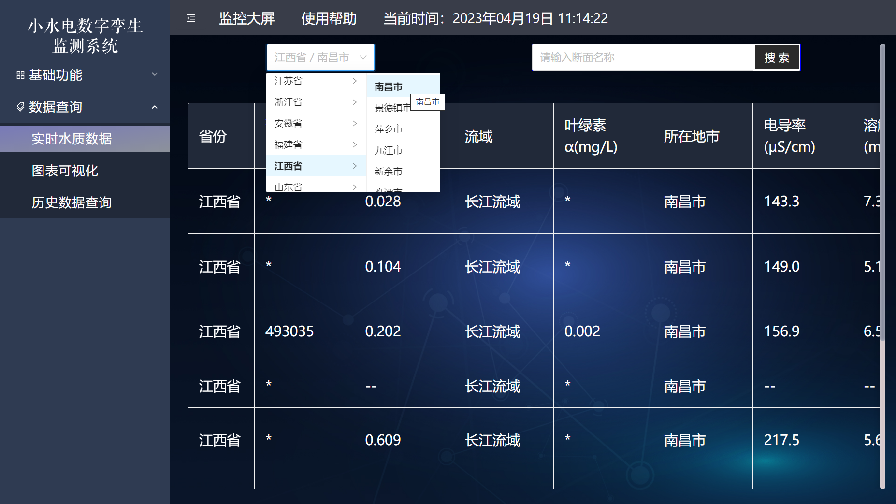

# 项目架构文件说明

## 项目结构

```
├── src
│   ├── App.jsx
│   ├── index.js
│   ├── Utils
│   │   ├── index.js
│   │   ├── layouttreset.js
│   │   ├── tableconfig.js
│   ├── Services
│   │   ├── request.js
│   │   ├── service.js
│   │   ├── Home
│   │   │   ├── index.js
│   │   │   ├── minute.js
│   │   │   ├── reset.js
│   │   │   ├── search.js
│   │   ├── waterQuality
│   │   │   ├── index.js
│   │   │   ├── filterData.js
│   │   │   ├── realData.js
│   │   ├── User
│   │   │   ├── user.js
│   ├── Router
│   │   ├── index.js
│   ├── Pages
│   │   ├── Home
│   │   │   ├── index.jsx
│   │   │   ├── index.less
│   │   │   ├── index.css
│   │   ├── MainPages
│   │   │   ├── HomePage
│   │   │   │   ├── MainChange
│   │   │   │   │   ├── index.jsx
│   │   │   │   │   ├── index.less
│   │   │   │   │   ├── index.css
│   ├── Components
│   │   ├── columns
│   │   │   ├── column.js
│   │   │   ├── columnSearch.js
│   │   ├── Map
│   │   │   ├── index.jsx
│   │   │   ├── index.less
│   │   │   ├── index.css
│   │   │   ├── map
│   │   │   │   ├── index.jsx
│   │   │   ├── search
│   │   │   │   ├── index.jsx
│   │   ├── MapDam
│   │   │   ├── index.jsx
│   │   │   ├── index.css
│   │   ├── MapSearch
│   │   │   ├── index.jsx
│   │   │   ├── index.css
│   │   ├── Tools
│   │   │   ├── MessageTool.js
│   ├── Common
│   │   ├── index.js
│   ├── Assets
│   │   ├── images
│   │   │   ├── home
│   │   │   ├── pic
│   │   ├── plugins
│   │   │   ├── animate.css
│   │   │   ├── webpack.config.js
│   │   ├── css
│   │   │   ├── comm.css
│   │   │   ├── comm.less
│   │   │   ├── default.css
│   │   ├── backup
│   │   │   ├── HandleData
│   │   │   ├── HomePage
│   │   │   ├── Services

```

## 项目说明

### 1. HomePage 部分

主菜单页面，标题为基础功能
映射关系，列出表格的列名和数据的映射关系
|页面名称|对应的 page 页|
|:---:|:---:|
|背景介绍|mainChange|
|位置分布|hourWaterForm|
|图表分析|dayWaterForm|
|3D 模型|rainChange|
|实时数据|whouseChange|
|图表可视化|waterChange|
|实时水质数据|minuteChange|
|历史数据查询|historySearch|

### 2. 组件使用部分

#### 2.1 MapDam 组件

地图组件，调用高德地图 API，安装了高德地图的 react 组件（react-amap），使用时需要在 index.html 中引入高德地图的 js 文件。实现了实时显示五个水库的地理位置，点击水库显示水库的详细信息。

#### 2.2 3D 模型组件

使用了 three.js 库，实现了 3D 模型的显示，使用了 three.js 的 OrbitControls 控制器，实现了鼠标控制模型的旋转，缩放，平移。同时调用 modaiyun 的 API，提升了展示效果。

#### 2.3 图表可视化组件

使用了 echarts 库，实现了图表的显示，并对实时数据进行可视化分析，同时调用 sovitjs，提升了展示效果。

### 2.4 水质数据查询组件

使用了 antd 的 table 组件，实现了水质数据的查询，并通过后端接口获取国家水质自动综合监管平台的水质数据，实现了对于全国范围的水质数据的查询。

## 项目运行

### 1. 安装依赖

```
npm install
```

### 2. 运行项目

```
npm run start
```

### 3. 打包项目

```
npm run build
```

## 项目部署

已有的项目部署在服务器上，可以直接访问
网站地址：<https://water-fe.miraitowa.tk/>

## 项目展示

### 1. 背景介绍



### 2.位置分布





### 3.图表分析

### 4.实时水质数据





